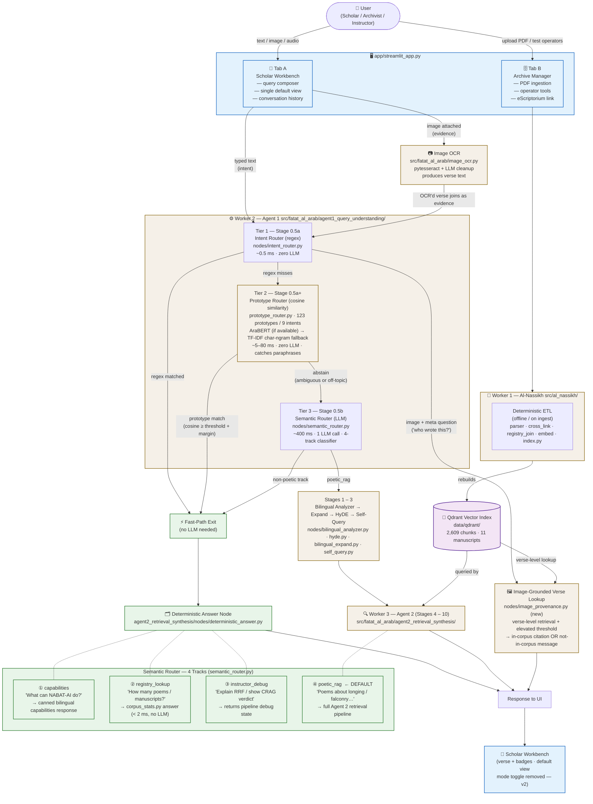

# NABAT-AI — Architecture Diagrams

**Course:** MAAI1704 – Generative AI | **Student:** Asma Salem Mubarak Najem Aljneibi  
**Date:** 2026-04-26 | Render in any Mermaid viewer (GitHub, VS Code, mermaid.live)

---

## Diagram 1 — System Interaction & Routing Overview

> How a user interacts with NABAT-AI, and the four tracks a query can take.

---

## Diagram 2 — Query Processing Flow (Step-by-Step)

> Every node: what it does, where it lives, when it exits early.

```mermaid
flowchart TD
    START(["User submits a query\n(typed text, voice, or uploaded manuscript image)"])

    IMAGE_TO_TEXT["Image-to-Text Converter\nsrc/fatat_al_arab/image_ocr.py\nRuns WHENEVER an image is attached — even if the user also typed text\npytesseract Arabic OCR + LLM cleanup pass for low-confidence handwriting\nProduces the verse text contained in the image — this is the EVIDENCE\nTyped text (if present) is preserved as the INTENT — what to do with the evidence\n  Image OCR text → 'which verse to look up' (search key)\n  Typed text      → 'what to do with that verse' (identify · translate · find more)\nOCR result is shown back to the user so they can correct misreads"]

    START -->|"image attached"| IMAGE_TO_TEXT
    START -->|"typed text\n(intent — what to do)"| INTENT_ROUTER
    IMAGE_TO_TEXT -->|"OCR'd verse\n(evidence — what to look up)"| INTENT_ROUTER

    subgraph AGENT1_BOX["AGENT 1 — Query Understanding   src/fatat_al_arab/agent1_query_understanding/"]

        INTENT_ROUTER["Tier 1 — Intent Router  (no AI call — instant, under 2 ms)\nnodes/intent_router.py\nScans the query using regex patterns — no LLM needed\nDetects: counting questions · age questions · provenance questions\n          capabilities · instructor debug · handwriting style\n          genre-aware counting ('how many love poems?' → count_poems_by_genre + غزل slot)\n          list-poets · child-grief elegies · image-grounded provenance\nIf deterministic intent matched: jumps to Fast Answer (no retrieval)\nIf genre-aware counting: Fast Answer hybrid path (deterministic count + LLM-prose framing)\nIf image-grounded provenance: jumps to Image-Grounded Verse Lookup"]

        INTENT_ROUTER -->|"regex matched\ne.g. 'how many poems?'"| FAST_EXIT["Skip to Fast Answer\n(bypasses all AI steps)"]
        INTENT_ROUTER -->|"image attached + meta question\ne.g. 'who wrote this?'"| IMG_PROV_LOOKUP
        INTENT_ROUTER -->|"regex misses"| PROTOTYPE_ROUTER

        PROTOTYPE_ROUTER["Tier 2 — Prototype Router  (no AI call — 5–80 ms)\nprototype_router.py\nEmbeds 123 prototype questions across 9 intents at startup\n(10–15 prototypes per intent · Arabic + English · 5 user personas)\nEncoder chain (graceful fallback):\n  ① AraBERT / AraPoemBERT via sentence-transformers (production)\n  ② TF-IDF char-ngram (3,5) cosine similarity (CI / fresh check-out)\nAt query time: embed user query once · cosine vs every prototype\nFires only if BOTH gates pass:\n  ◇ top similarity ≥ threshold (0.65 AraBERT / 0.55 TF-IDF)\n  ◇ margin ≥ 0.05 over the runner-up intent's best prototype\nAmbiguous queries deliberately abstain → fall through to LLM router\nCatches paraphrases regex misses: 'tally of authors' · 'the names of the writers' ·\n                                  'size of the manuscript collection' · 'tell me your skills' ·\n                                  'elegies mourning a child' · 'قصائد رثاء الأبناء'"]

        PROTOTYPE_ROUTER -->|"prototype match\n(both gates passed)"| FAST_EXIT
        PROTOTYPE_ROUTER -->|"abstained\n(ambiguous or off-topic)"| SEMANTIC_ROUTER

        SEMANTIC_ROUTER["Tier 3 — Semantic Router  (1 AI call — cached per query)\nnodes/semantic_router.py\nLLM classifies the query into exactly ONE of four tracks:\n  ① capabilities       — 'what can NABAT-AI do?' / 'what manuscripts do you have?'\n  ② registry_lookup    — counting · dates · regions · collector names\n  ③ instructor_debug   — 'explain RRF' · 'show CRAG verdict' · pipeline internals\n  ④ poetic_rag         — any poetry search or literary question  ← DEFAULT\nDefault is always poetic_rag — only switches track when confidence is high\nResult cached (LRU 256 slots) so repeated identical queries skip this step"]

        SEMANTIC_ROUTER -->|"not a poetry search"| FAST_EXIT
        SEMANTIC_ROUTER -->|"poetry search"| LANGUAGE_ANALYZER

        LANGUAGE_ANALYZER["Language and Intent Analyzer  (1 AI call)\nnodes/bilingual_analyzer.py\nDetects the query language: Arabic · English · Mixed\nTranslates the query into both Arabic and English\nIdentifies the topic intent and dialect (Khaleeji vs. Modern Standard Arabic)\nOutputs: Arabic version of query · English version · intent confidence score"]

        LANGUAGE_ANALYZER -->|"intent confidence below 0.5\n(too ambiguous to proceed)"| CLARIFY_USER["Ask user to clarify\n(question returned to chat)"]
        LANGUAGE_ANALYZER -->|"confident"| QUERY_EXPANDER

        QUERY_EXPANDER["Query Expander  (1 AI call)\nnodes/bilingual_expand.py\nGenerates 3 to 5 alternative phrasings in both Arabic and English\nExample: 'poem about longing' →\n  'قصيدة شوق' · 'شعر الغياب' · 'verse of absence' · 'lament of distance'\nPurpose: keyword search finds more relevant poems\nwhen it has multiple ways to express the same idea"]

        QUERY_EXPANDER --> VERSE_GENERATOR

        VERSE_GENERATOR["Hypothetical Verse Generator  (1 AI call — 3 second timeout)\nnodes/hyde.py\nWrites a short invented Nabati verse in the style of an answer\nThis made-up verse is converted into a search vector\nPurpose: searching with a poem-shaped query finds\nreal poems much more accurately than a plain question\nTechnique name: HyDE (Hypothetical Document Embedding)"]

        VERSE_GENERATOR --> FILTER_EXTRACTOR

        FILTER_EXTRACTOR["Search Filter Extractor  (1 AI call)\nnodes/self_query.py\nExtracts structured filters from the natural-language query:\n  Poet name · Manuscript identifier · Genre · Emotion\n  Page range · Verse range · Theme\nHard filters (confidence 70%+): results must match exactly\nSoft filters (confidence below 70%): used for score boosting only\nManuscript names are resolved via fuzzy matching on the registry"]

    end

    subgraph IMG_GROUNDED["IMAGE-GROUNDED PROVENANCE PATH   src/fatat_al_arab/agent2_retrieval_synthesis/"]

        IMG_PROV_LOOKUP["Image-Grounded Verse Lookup\nnodes/image_provenance.py (new)\nUses the OCR'd verse as the SEARCH KEY — not the typed question\nVerse-level retrieval only · elevated similarity threshold\nGoal: identify the source manuscript, not find thematically related passages\nA 'related' hit is not enough — we need a confident match or an honest 'no match'"]

        IMG_PROV_LOOKUP -->|"similarity ≥ threshold"| IMG_FOUND["✅ In Corpus — Cited Identification\nReturns: poet · manuscript · page · anchor_id · folio scan\nThe typed INTENT shapes the answer:\n  'who wrote this?'              → poet name + bio\n  'translate this'               → bilingual translation of matched verse\n  'show me more by this poet'    → poet's other works in the corpus"]

        IMG_PROV_LOOKUP -->|"similarity < threshold"| IMG_NOT_FOUND["❌ Not in Corpus — Specific Message (NOT the generic refusal)\n'This verse is not present in the 1,502 digitised anchors.'\nShows the nearest near-match with similarity % so the user has context\nOffers contribution path via Tab B — Archive Manager\nDistinguishable from system-failure refusals — distinct UI badge"]

    end

    FAST_EXIT --> FAST_ANSWER
    IMG_FOUND --> FINAL_RESPONSE
    IMG_NOT_FOUND --> FINAL_RESPONSE
    FILTER_EXTRACTOR --> RETRIEVER

    subgraph AGENT2_BOX["AGENT 2 — Retrieval and Synthesis   src/fatat_al_arab/agent2_retrieval_synthesis/"]

        FAST_ANSWER["Fast Answer Node\nnodes/deterministic_answer.py\nAnswers counting, capability, and debug questions\ndirectly from the manuscript registry — no search needed\nGenre-aware counting (e.g. 'how many love poems?'): hybrid path —\n  exact count from enriched registry (e.g. 157 غزل) + top-poet sample\n  LLM writes fluent bilingual prose grounded in those numbers (no hallucination)\nResponse is bilingual: Arabic and English\nDisplayed with 🗂️ badge in the Scholar Workbench"]

        RETRIEVER["Triple Hybrid Retriever\nnodes/retrieve.py\nSearches the Qdrant index using three methods at once:\n  BM25 — keyword search (exact Arabic word matching)\n  Dense AraBERT — semantic search (meaning-based matching)\n  ColBERT — token-level deep matching\nHard filters applied first to narrow the candidate pool\nIf hard filters eliminate all results: relaxes to unfiltered search"]

        RETRIEVER --> RESULT_RANKER

        RESULT_RANKER["Result Ranker — Reciprocal Rank Fusion\nnodes/rrf_fuse.py + src/fatat_al_arab/rrf.py\nCombines the three search result lists into one ranked list\nBoosts results that match the requested poet or manuscript (1.5× multiplier)\nRemoves duplicates — keeps the highest score per poem anchor\nFinal output: top 5 most relevant passages"]

        RESULT_RANKER -->|"no results found\n(first attempt only)"| FILTER_RELAXER["Filter Relaxer\nnodes/crag_grader.py (helper step)\nDrops hard filters and retries the search\nto allow a broader second retrieval pass"]
        FILTER_RELAXER --> RETRIEVER

        RESULT_RANKER -->|"passages found\nor already retried"| REGISTRY_JOINER

        REGISTRY_JOINER["Registry and Biography Joiner\nnodes/resolve_heritage.py\nEnriches each retrieved passage with full metadata:\n  Full opening verse (matla text)\n  Poet biography from poets_bio.json\n  Volume number and page number\n  Path to the manuscript scan image\n  Manuscript name in Arabic and English\nMarks whether a citation link can be resolved"]

        REGISTRY_JOINER --> PASSAGE_GRADER

        PASSAGE_GRADER["Passage Quality Grader  (1 AI call)\nnodes/crag_grader.py\nLLM reads each retrieved passage and rates it:\n  Correct — clearly answers the query\n  Ambiguous — partially relevant\n  Incorrect — off-topic or unrelated\nIf all passages are Incorrect: triggers one retry with relaxed filters\nTechnique name: CRAG (Corrective Retrieval-Augmented Generation)"]

        PASSAGE_GRADER -->|"all passages Incorrect\nand not yet retried"| SECOND_SEARCH["Second Search Attempt\n(broader filters)\nBroader retrieval before giving up"]
        SECOND_SEARCH --> RETRIEVER

        PASSAGE_GRADER -->|"at least one Correct or Ambiguous\nor already retried"| ANSWER_GENERATOR

        ANSWER_GENERATOR["Answer Generator  (1 AI call)\nnodes/synthesise.py\nWrites a bilingual Arabic and English answer\nusing only the retrieved passages (no invented information)\nAll verses are quoted verbatim from the manuscript text\nEvery factual claim must have a citation — invention is refused\nRefuses to answer if the retrieved passages are insufficient"]

        ANSWER_GENERATOR --> QUALITY_CRITIC

        QUALITY_CRITIC["Quality Critic  (1 AI call)\nnodes/reflect.py\nCritiques the generated answer on three dimensions:\n  Faithfulness — does it accurately reflect the source text?\n  Relevance — does it actually answer what was asked?\n  Completeness — is anything important left out?\nIf answer fails: sends back to Answer Generator (maximum 2 retries)\nTechnique name: Self-RAG"]

        QUALITY_CRITIC -->|"answer failed\nretry allowed (max 2)"| ANSWER_GENERATOR

        QUALITY_CRITIC -->|"answer passed\nor maximum retries reached"| RESPONSE_FORMATTER

        RESPONSE_FORMATTER["Response Formatter and Safety Check\nnodes/format_variants.py + src/fatat_al_arab/guardrails.py\nProduces three text versions of every poem quote:\n  al-Maktub — written Khaleeji Arabic script\n  Orthographic MSA — Modern Standard Arabic spelling\n  al-Mantuq — spoken transliteration showing pronunciation\nSafety checks: citations present · verses quoted verbatim\n                 topic is within Nabati poetry scope\nIf safety check fails: substitutes a bilingual refusal message"]

    end

    FAST_ANSWER --> FINAL_RESPONSE
    RESPONSE_FORMATTER --> FINAL_RESPONSE

    FINAL_RESPONSE(["Response delivered to Scholar Workbench\napp/streamlit_app.py\nSingle default view — verse + metadata badges\n(view mode toggle removed in v2 — fixed to Scholar / default)"])
```

---

## Diagram 3 — Archive Manager Contribution Pipeline (Step-by-Step)

> Your five-phase workflow for adding a new poem — from checking the corpus through making it searchable in Tab A.
> Golden Rule: **every contribution made in Tab B must be reflected and searchable in Tab A (Scholar Workbench). The index rebuild in Phase 5 is what makes that connection live.**

```mermaid
flowchart TD
    START(["🗄️ Archive Manager — Tab B\nContributor wants to add a new poem to the corpus\napp/streamlit_app.py"])

    START --> CORPUS_CHECK

    subgraph PHASE2_BOX["📋 Phase 2 — Check the Corpus First  (do this before anything else)"]
        CORPUS_CHECK["Search the Scholar Workbench (Tab A) first\nType the opening verse or poet name in the search box\nConfirm the poem is not already indexed\nWhy: the index does not auto-deduplicate — adding twice\ncreates ghost entries that corrupt search results"]
    end

    CORPUS_CHECK -->|"poem already found"| ALREADY_EXISTS(["✅ Poem already in the corpus\nSearchable in Tab A — no action needed"])
    CORPUS_CHECK -->|"poem is new — proceed"| CHOOSE_PATH

    CHOOSE_PATH{"What do you have?\nChoose your contribution path"}

    CHOOSE_PATH -->|"I have the text only\nfastest path — no scan needed"| METADATA_FORM
    CHOOSE_PATH -->|"I have a single page scan\nwant to check quality first"| SINGLE_PAGE_UPLOAD
    CHOOSE_PATH -->|"I have the full manuscript PDF\nentire document new to the system"| FULL_PDF_UPLOAD

    subgraph PHASE1_BOX["✏️ Phase 1 — Metadata Entry  (primary path — fastest, no image processing)"]
        METADATA_FORM["Fill in the Metadata Form\nTab B · Metadata Entry section\nRequired fields:\n  matla_text — the opening verse in Arabic\n  poet_name — full name of the poet\n  manuscript_short_key — e.g. ms05 (al_suwaygh) · ms06 (al_daoud)\n  page_number — page number in the original manuscript\n  occasion — the event or context the poem was composed for\nResult: new entry appended directly to\n  data/ground_truth/anchor_registry_phase4.json"]
    end

    subgraph PHASE3_BOX["🔍 Phase 3 — Operator Preview  (optional quality check for a single scan)"]
        SINGLE_PAGE_UPLOAD["Upload One Page Scan\nAccepted formats: PNG · JPG · PDF (single page)\nRuns a quality check pipeline before committing the scan"]

        SINGLE_PAGE_UPLOAD --> PAGE_TRIAGE["Page Triage — Quality Gate\nsrc/al_nassikh/operator/triage.py\nDetects: bleed-through · torn edges · heavy water staining\nVerdict:\n  NORMAL — page is usable, continue pipeline\n  DEGRADED — too damaged, held for manual expert review"]

        PAGE_TRIAGE -->|"DEGRADED"| SPECIALIST_HOLD(["⚠️ Held for specialist review\nNot automatically ingested"])

        PAGE_TRIAGE -->|"NORMAL"| BLEED_SUPPRESS["Bleed Suppression\nsrc/al_nassikh/operator/bleed_suppress.py\nRemoves ghost ink from recto/verso bleed-through\n(opposite-side page text showing through the paper)"]

        BLEED_SUPPRESS --> STANDARDISE["Standardise the Image\nsrc/al_nassikh/operator/standardise.py\nDeskews the scan (corrects tilted pages)\nResizes to 300 DPI standard resolution\nSharpens diacritic marks so HTR reads them correctly"]

        STANDARDISE --> PREVIEW_PASS["Quality preview complete\nImage is clean and ready\nProceed to enter metadata in Phase 1"]
    end

    subgraph PHASE4_BOX["🖥️ Phase 4 — Full HTR via eScriptorium  (for manuscripts entirely new to the system)"]
        FULL_PDF_UPLOAD["Upload the Full Manuscript PDF\nAll pages of the manuscript\nTab B · Full Manuscript Submission\nUse this path when the document does not exist in the corpus at all\nSelf-host eScriptorium using: infra/escriptorium/docker-compose.yml"]

        FULL_PDF_UPLOAD --> SPLIT_TO_PAGES["Split PDF into Per-Page Images\nsrc/al_nassikh/ingest/pdf_to_pages.py\nConverts every page to a 300 DPI PNG file\nOutput: manuscripts/MVP_Ground_Truth_Images/Phase_N/page_XXXX.png"]

        SPLIT_TO_PAGES --> FULL_OPERATOR_PIPELINE["Run the Full Operator Pipeline\nTriage → Bleed Suppression → Standardise\nIntrusion Mask (stamp and label removal)\nStyle Profile (Naskh · Ruqʿah · Calligraphic · Hurr)\nEnqueue pages in the operator review queue"]

        FULL_OPERATOR_PIPELINE --> ESCRIPTORIUM_SUBMIT["Submit to Self-Hosted eScriptorium\nsrc/al_nassikh/escriptorium_client.py\nCreate a named project for this manuscript\nCreate a document (one document = one manuscript)\nUpload all cleaned page images\nPre-seed the five Khaleeji zone labels for the annotator\nRun Kraken BLLA segmentation to detect text-line baselines"]

        ESCRIPTORIUM_SUBMIT --> HUMAN_ANNOTATION["Human Annotation in eScriptorium Editor\nScholar opens eScriptorium in the browser\nCorrects auto-transcribed text lines (HTR output)\nConfirms and adjusts layout zone labels:\n  TWO_COLUMN_POETRY · PROSE_ATTRIBUTION\n  ORNAMENTAL_DIVIDER · MARGIN_PERPENDICULAR\nQueue status: pending → in_review during this step"]

        HUMAN_ANNOTATION --> EXPORT_PAGE_XML["Export Annotated PAGE-XML\nescriptorium_client.export_pagexml()\nDownloads fully corrected transcription files\nto: manuscripts/Ground_Truth_Exports/\nQueue status: → complete after export"]

        EXPORT_PAGE_XML --> PARSE_TO_REGISTRY["Parse PAGE-XML into Registry Entries\nsrc/al_nassikh/parser.py\nConverts annotated XML into anchor_registry JSON format\nRun QA Jury to flag low-confidence text lines\nMerge new entries into anchor_registry_phase4.json"]
    end

    PREVIEW_PASS --> METADATA_FORM
    PARSE_TO_REGISTRY --> GENRE_TAGGER
    METADATA_FORM --> GENRE_TAGGER

    subgraph PHASE5_BOX["🚀 Phase 5 — Enrich and Rebuild  (makes the poem searchable in Tab A)"]
        GENRE_TAGGER["Auto-Tag Genre and Emotion\nscripts/enrich_genre_heuristic.py\nsrc/al_nassikh/genre_heuristic.py\nRuns the silver-baseline classifier over all new entries\n43% genre coverage — abstains to غير_محدد when unsure\nAll heuristic results are marked with 🔸 badge (heuristic_v1)\nOutput: data/ground_truth/anchor_registry_phase4_enriched.json"]

        GENRE_TAGGER --> INDEX_REBUILD["Rebuild the Qdrant Search Index\nscripts/rebuild_index.py + src/fatat_al_arab/index.py\nEmbeds every poem using AraBERT (768-dimensional vectors)\nCreates three levels of search chunks per poem:\n  verse-level · group-level · poem-level\nWrites updated index to:\n  data/qdrant/chunks_meta.json\n  data/qdrant/embeddings.npy\nThis step is what connects Tab B contributions to Tab A"]
    end

    INDEX_REBUILD --> SEARCHABLE(["✅ Poem is now searchable in Tab A — Scholar Workbench\nAny user can find the new poem via text, filter, or image query\nGolden Rule fulfilled:\nEvery contribution made in Tab B\nis reflected and searchable in Tab A\nThe index rebuild is what makes that connection live"])

    classDef phase1style fill:#e8f5e9,stroke:#2e7d32,stroke-width:2px
    classDef phase2style fill:#e3f2fd,stroke:#1565c0,stroke-width:2px
    classDef phase3style fill:#fff8e1,stroke:#f57f17,stroke-width:2px
    classDef phase4style fill:#e8eaf6,stroke:#283593,stroke-width:2px
    classDef phase5style fill:#fce4ec,stroke:#880e4f,stroke-width:2px
    classDef terminal fill:#f3e5f5,stroke:#4a148c,stroke-width:2.5px,font-weight:bold

    class METADATA_FORM phase1style
    class CORPUS_CHECK phase2style
    class SINGLE_PAGE_UPLOAD,PAGE_TRIAGE,BLEED_SUPPRESS,STANDARDISE,PREVIEW_PASS phase3style
    class FULL_PDF_UPLOAD,SPLIT_TO_PAGES,FULL_OPERATOR_PIPELINE,ESCRIPTORIUM_SUBMIT,HUMAN_ANNOTATION,EXPORT_PAGE_XML,PARSE_TO_REGISTRY phase4style
    class GENRE_TAGGER,INDEX_REBUILD phase5style
    class START,ALREADY_EXISTS,SPECIALIST_HOLD,SEARCHABLE terminal
```

---

## Step Reference Tables

### Diagram 2 — Query Flow: Each Step at a Glance

| Step             | Full Name                              | File                                                                                                                                                                   | Purpose                                                                                                                                                                                                                                                                                                            |
| ---------------- | -------------------------------------- | ---------------------------------------------------------------------------------------------------------------------------------------------------------------------- | ------------------------------------------------------------------------------------------------------------------------------------------------------------------------------------------------------------------------------------------------------------------------------------------------------------------ |
| Image Input      | Image-to-Text Converter                | `src/fatat_al_arab/image_ocr.py`                                                                                                                                       | pytesseract Arabic OCR (LLM cleanup for low-confidence handwriting) — runs **whenever an image is attached**, even if text was also typed. Image OCR provides the **evidence** (verse to look up); typed text provides the **intent** (what to do with it)                                                         |
| 1                | Intent Router (Tier 1 — regex)         | `agent1_query_understanding/nodes/intent_router.py`                                                                                                                    | Instant regex scan: counting / capabilities / debug / list-poets / child-grief / handwriting style — no AI call. ~0.5 ms.                                                                                                                                                                                          |
| 1b               | Prototype Router (Tier 2 — embedding)  | `agent1_query_understanding/prototype_router.py`                                                                                                                       | 123 prototype questions across 9 intents (10–15 per intent · AR + EN · 5 personas) embedded once at startup. Cosine similarity to nearest prototype with **threshold + margin gate**; ambiguous queries abstain. Encoder chain: AraBERT → TF-IDF char-ngram fallback. Catches paraphrases the regex misses (e.g. "tally of authors", "the names of the writers", "tell me your skills"). ~5–80 ms · zero LLM. |
| 2                | Semantic Router (Tier 3 — LLM)         | `agent1_query_understanding/nodes/semantic_router.py`                                                                                                                  | LLM classifies into 4 tracks: ① capabilities ② registry_lookup ③ instructor_debug ④ poetic_rag (default). Tracks ①–③ → fast path. Track ④ → full retrieval pipeline. Cached (LRU 256). ~400 ms.                                                                                                                |
| 3                | Language and Intent Analyzer           | `agent1_query_understanding/nodes/bilingual_analyzer.py`                                                                                                               | Language detection + intent confidence + dialect identification                                                                                                                                                                                                                                                    |
| 4                | Query Expander                         | `agent1_query_understanding/nodes/bilingual_expand.py`                                                                                                                 | 3–5 Arabic and English paraphrases to improve keyword-search recall                                                                                                                                                                                                                                                |
| 5                | Hypothetical Verse Generator (HyDE)    | `agent1_query_understanding/nodes/hyde.py`                                                                                                                             | Generates a hypothetical verse used as a semantic search vector                                                                                                                                                                                                                                                    |
| 6                | Search Filter Extractor                | `agent1_query_understanding/nodes/self_query.py`                                                                                                                       | Extracts hard and soft filters (poet · manuscript · genre · emotion · page range)                                                                                                                                                                                                                                  |
| 7                | Fast Answer Node                       | `agent2_retrieval_synthesis/nodes/deterministic_answer.py`                                                                                                             | Bilingual answer for counts / capabilities / debug — no retrieval needed                                                                                                                                                                                                                                           |
| 7a               | Genre-aware Counting                   | `agent2_retrieval_synthesis/nodes/deterministic_answer.py` (`_answer_count_by_genre`) + `al_nassikh/corpus_stats.py` (`count_poems_by_genre`, `sample_poets_by_genre`) | Hybrid fast path: intent router extracts the genre slot (e.g. "love poems" → غزل); `count_poems_by_genre` returns the exact filtered count from the enriched registry; `sample_poets_by_genre` supplies top-3 poets; LLM writes fluent bilingual prose grounded in those numbers. No vector retrieval.             |
| 8                | Triple Hybrid Retriever                | `agent2_retrieval_synthesis/nodes/retrieve.py`                                                                                                                         | BM25 + Dense AraBERT + ColBERT — hard filters applied first                                                                                                                                                                                                                                                        |
| 9                | Result Ranker (Reciprocal Rank Fusion) | `agent2_retrieval_synthesis/nodes/rrf_fuse.py` + `rrf.py`                                                                                                              | Combines three ranked lists; boosts matching poet/MS; deduplicates                                                                                                                                                                                                                                                 |
| 10               | Registry and Biography Joiner          | `agent2_retrieval_synthesis/nodes/resolve_heritage.py`                                                                                                                 | Joins retrieved chunk IDs to full registry and poet bio data                                                                                                                                                                                                                                                       |
| 11               | Passage Quality Grader (CRAG)          | `agent2_retrieval_synthesis/nodes/crag_grader.py`                                                                                                                      | LLM rates each passage: Correct / Ambiguous / Incorrect; re-queries once if all Incorrect                                                                                                                                                                                                                          |
| 12               | Answer Generator                       | `agent2_retrieval_synthesis/nodes/synthesise.py`                                                                                                                       | LLM grounded generation — verbatim verse, mandatory citations                                                                                                                                                                                                                                                      |
| 13               | Quality Critic (Self-RAG)              | `agent2_retrieval_synthesis/nodes/reflect.py`                                                                                                                          | Checks faithfulness + relevance + completeness; retries up to 2×                                                                                                                                                                                                                                                   |
| 14               | Response Formatter and Safety Check    | `agent2_retrieval_synthesis/nodes/format_variants.py` + `guardrails.py`                                                                                                | Three text variants; citation + verbatim + scoped-refusal guards                                                                                                                                                                                                                                                   |
| Image Provenance | Image-Grounded Verse Lookup            | `agent2_retrieval_synthesis/nodes/image_provenance.py` (new)                                                                                                           | Triggered when an image is attached + the typed query is a meta-question (e.g. 'who wrote this?'). Searches verse-level chunks using the OCR'd text + elevated similarity threshold. Two distinct outcomes: in-corpus → cited identification; not-in-corpus → specific bilingual message (not the generic refusal) |

### Diagram 3 — Archive Manager: Five-Phase Pipeline at a Glance

| Phase   | Step                       | File                                                  | Purpose                                                             |
| ------- | -------------------------- | ----------------------------------------------------- | ------------------------------------------------------------------- |
| Phase 2 | Search Corpus              | Tab A — Scholar Workbench                             | Verify poem not already indexed before doing anything               |
| Phase 1 | Metadata Entry             | Tab B form → `anchor_registry_phase4.json`            | Fastest path: type fields directly, append to registry              |
| Phase 3 | Page Triage                | `al_nassikh/operator/triage.py`                       | Quality gate: NORMAL vs DEGRADED                                    |
| Phase 3 | Bleed Suppression          | `al_nassikh/operator/bleed_suppress.py`               | Remove ghost ink from recto/verso bleed-through                     |
| Phase 3 | Standardise                | `al_nassikh/operator/standardise.py`                  | Deskew + resize to 300 DPI + sharpen diacritics                     |
| Phase 4 | Split PDF                  | `al_nassikh/ingest/pdf_to_pages.py`                   | Full manuscript PDF → 300 DPI per-page PNGs                         |
| Phase 4 | Full Operator Pipeline     | `al_nassikh/operator/` (all operators)                | Triage → Bleed → Standardise → Mask → Style → Enqueue               |
| Phase 4 | eScriptorium Submission    | `al_nassikh/escriptorium_client.py`                   | Create project/document, upload pages, run Kraken BLLA segmentation |
| Phase 4 | Human Annotation (HITL)    | eScriptorium editor UI                                | Scholar corrects transcription and zone labels                      |
| Phase 4 | Export PAGE-XML            | `al_nassikh/escriptorium_client.py`                   | Download fully annotated transcription files                        |
| Phase 4 | Parse to Registry          | `al_nassikh/parser.py` + `phase4_merger.py`           | Convert XML to JSON anchor entries + merge into registry            |
| Phase 5 | Auto-Tag Genre and Emotion | `scripts/enrich_genre_heuristic.py`                   | Silver-baseline classifier — 43% coverage — 🔸 badge                |
| Phase 5 | Rebuild Search Index       | `scripts/rebuild_index.py` + `fatat_al_arab/index.py` | AraBERT embed → 3-level chunks → Qdrant write → Tab A searchable    |

---

## Diagram 4 — Agent Architecture Components

> Maps the four standard AI-agent components (Brain, Planning, Memory, Tools) to NABAT-AI source files.  
> Rows marked **[updated]** reflect the 2026-04-25 agentic-loop upgrade that gave the LLM authority over re-query and retry decisions.

| Agent Component                                         | Your Code                                                                                                                                                                                                                                    | Why It Matters & Where It Lives                                                                                                                                                                                                                                                                                                                                        |
| ------------------------------------------------------- | -------------------------------------------------------------------------------------------------------------------------------------------------------------------------------------------------------------------------------------------- | ---------------------------------------------------------------------------------------------------------------------------------------------------------------------------------------------------------------------------------------------------------------------------------------------------------------------------------------------------------------------- |
| **🧠 Brain — Core LLM**                                 | `llm.py` — `chat()` adapter; Qwen2.5-7B primary + Mistral-7B fallback via Together.ai / Groq                                                                                                                                                 | Every reasoning step routes through one place. Swapping providers or adding a fallback requires changing one file, not ten. `src/fatat_al_arab/llm.py`                                                                                                                                                                                                                 |
| **🧠 Brain — Routing (3-tier funnel)** ✦ **[updated]**  | **Tier 1** `intent_router.py` (regex fast-path, ~0.5 ms) → **Tier 2** `prototype_router.py` (AraBERT / TF-IDF cosine over 123 prototypes, ~5–80 ms, zero-LLM paraphrase catcher) → **Tier 3** `semantic_router.py` (LLM 4-track classifier, ~400 ms, cached) | Three increasing-cost classifiers in series, each gated to abstain when uncertain. Tier 1 handles exact cues, Tier 2 handles paraphrases ("tally of authors", "size of the manuscript collection"), Tier 3 handles everything novel. Net effect: ~70% of meta-queries answered in < 100 ms with zero LLM tokens, while genuine poetry queries still flow to full RAG. `agent1_query_understanding/nodes/intent_router.py`, `agent1_query_understanding/prototype_router.py`, `agent1_query_understanding/nodes/semantic_router.py` |
| **📋 Planning — Step-by-step**                          | `agent1/graph.py` + `agent2/graph.py` — LangGraph `StateGraph` with conditional edges across Stages 0.5 → 10                                                                                                                                 | Breaks a user query into 10 ordered stages. LangGraph enforces the sequence and branch logic so no stage is skipped or double-executed. `src/fatat_al_arab/agent1_query_understanding/graph.py`, `agent2_retrieval_synthesis/graph.py`                                                                                                                                 |
| **📋 Planning — HyDE**                                  | `hyde.py` (Stage 2a) — generates a hypothetical Nabati verse as a retrieval seed                                                                                                                                                             | Improves dense retrieval accuracy by querying with an ideal answer rather than the raw user question. `agent1_query_understanding/nodes/hyde.py`                                                                                                                                                                                                                       |
| **📋 Planning — Query Expansion**                       | `bilingual_expand.py` (Stage 2b) — produces 3–5 AR + EN paraphrases                                                                                                                                                                          | Compensates for dialect variation in Nabati poetry — the same verse can appear under many orthographic forms. `agent1_query_understanding/nodes/bilingual_expand.py`                                                                                                                                                                                                   |
| **📋 Reflection — CRAG Grading** ✦ **[updated]**        | `crag_grader.py` (Stage 7) — grades each passage Correct / Ambiguous / Incorrect; **now also outputs `requery_strategy`**: specific Arabic terms and manuscript sections to search for on re-query; triggers at most 1 LLM-directed re-query | Prevents hallucination AND makes the re-query intelligent. When passages fail, the LLM explains *why* and *what to search for instead*. `retrieve.py` blends this strategy into the BM25 query on the second pass — the re-query is no longer a blind filter relaxation. `agent2_retrieval_synthesis/nodes/crag_grader.py`, `state.py` (`crag_requery_strategy` field) |
| **📋 Reflection — Self-RAG** ✦ **[updated]**            | `reflect.py` (Stage 9) — scores faithfulness + relevance + completeness; **now also outputs `fix_instructions*`* (exact rewrite directive) **and `failed_claims`** (verbatim unsupported phrases); retries ≤ 2×                              | The retry loop is now surgical — `synthesise.py` receives the exact claim to remove and the passage to cite instead, not a generic "improve faithfulness" string. `agent2_retrieval_synthesis/nodes/reflect.py`                                                                                                                                                        |
| **🗃️ Memory — Short-term**                             | `AgentState["conversation_history"]` — last 5 turns stored in `state.py`                                                                                                                                                                     | Gives Agent 1 (`bilingual_analyzer`) and Agent 2 (`synthesise`) continuity across a multi-turn session without re-reading the full history each turn. `src/fatat_al_arab/state.py`                                                                                                                                                                                     |
| **🗃️ Memory — Long-term (Vector DB)**                  | `data/qdrant/` — 2,609 chunks from 11 manuscripts, built by `index.py` + `embed.py` (AraBERT 768-dim)                                                                                                                                        | The corpus's entire semantic content lives here. Retrieval fetches relevant verses in milliseconds rather than scanning 1,502 JSON anchors linearly. `src/fatat_al_arab/index.py`, `embed.py`, `data/qdrant/`                                                                                                                                                          |
| **🗃️ Memory — Long-term (Registry)**                   | `registry.py` + `manuscript_registry.json` — 25 manuscripts, short keys, AR/EN names                                                                                                                                                         | Deterministic lookups ("how many poems?", "who wrote this?") are answered from structured data in < 2 ms, skipping the LLM entirely. `src/al_nassikh/registry.py`, `data/ground_truth/manuscript_registry.json`                                                                                                                                                        |
| **🛠️ Tools — Triple Hybrid Retrieval** ✦ **[updated]** | `retrievers/bm25.py` + `retrievers/dense.py` + `retrievers/colbert.py` fused by `rrf.py`; **on re-query, `retrieve.py` augments the BM25 query with the CRAG `requery_strategy`**                                                            | No single retriever handles all query types. BM25 handles exact terms, dense handles semantics, ColBERT handles token-level. On a CRAG-triggered re-query the LLM's strategy is injected as additional search terms. `src/fatat_al_arab/retrievers/`, `rrf.py`, `retrieve.py`                                                                                          |
| **🛠️ Tools — Image OCR**                               | `image_ocr.py` — Pytesseract Arabic OCR; converts a manuscript photo into a query string                                                                                                                                                     | Enables multimodal input: a user can photograph a verse and query it directly. `src/fatat_al_arab/image_ocr.py`                                                                                                                                                                                                                                                        |
| **🛠️ Tools — Translation**                             | `translate.py` — AR ↔ EN via the LLM adapter                                                                                                                                                                                                 | Allows English-speaking researchers to query an Arabic corpus and receive bilingual answers. `src/fatat_al_arab/translate.py`                                                                                                                                                                                                                                          |
| **🛠️ Tools — eScriptorium API**                        | `escriptorium_client.py` — REST wrapper (7 operations: `ensure_project` → `export_pagexml`)                                                                                                                                                  | Connects the pipeline to the HTR platform for ingesting new manuscripts; degrades gracefully when Docker is not running. `src/al_nassikh/escriptorium_client.py`                                                                                                                                                                                                       |
| **🔗 Orchestrator**                                     | `orchestrator.py` — `run()` / `run_agent1()` / `run_agent2()` public entry points                                                                                                                                                            | The single seam that wires Agent 1 → `QueryContext` handoff → Agent 2. Never raises — always returns a displayable dict to the UI. `src/fatat_al_arab/orchestrator.py`                                                                                                                                                                                                 |
| **🛡️ Guardrails**                                      | `guardrails.py` — `should_refuse()` + bilingual AR/EN refusal templates                                                                                                                                                                      | Ensures out-of-corpus queries return an honest "not found" rather than a hallucinated answer. `src/fatat_al_arab/guardrails.py`                                                                                                                                                                                                                                        |

> **✦ Agentic-loop upgrade (2026-04-25):** Before this upgrade the CRAG re-query was a blind filter relaxation and the Self-RAG retry received a vague "improve faithfulness" string. After the upgrade the LLM drives both loops: it reasons about *why* passages failed and *what to search for instead* (CRAG), and names the *exact unsupported claim* to fix (Self-RAG). No structural changes — same 10 stages, same LangGraph graph. The change is entirely in the prompts and state contract.
>
> **✦ Tier 2 paraphrase router (2026-04-26):** Inserted between the regex fast-path (Tier 1) and the LLM classifier (Tier 3) so paraphrased meta-questions short-circuit to the deterministic answer node without spending an LLM call. 123 prototype questions across 9 intents, embedded once at startup; query time uses cosine similarity with a threshold + margin gate so ambiguous queries deliberately fall through. Encoder chain is graceful: AraBERT (production) falls back to TF-IDF char-n-gram (CI / fresh check-out). Adds two new fields to `query_context`: `router_source` records which tier fired (`regex` / `prototype_arabert` / `prototype_tfidf` / `llm`), and `router_cues` lists which prototype the query matched. Same LangGraph graph — Tier 2 lives inside `intent_router_node`, no topology change.

