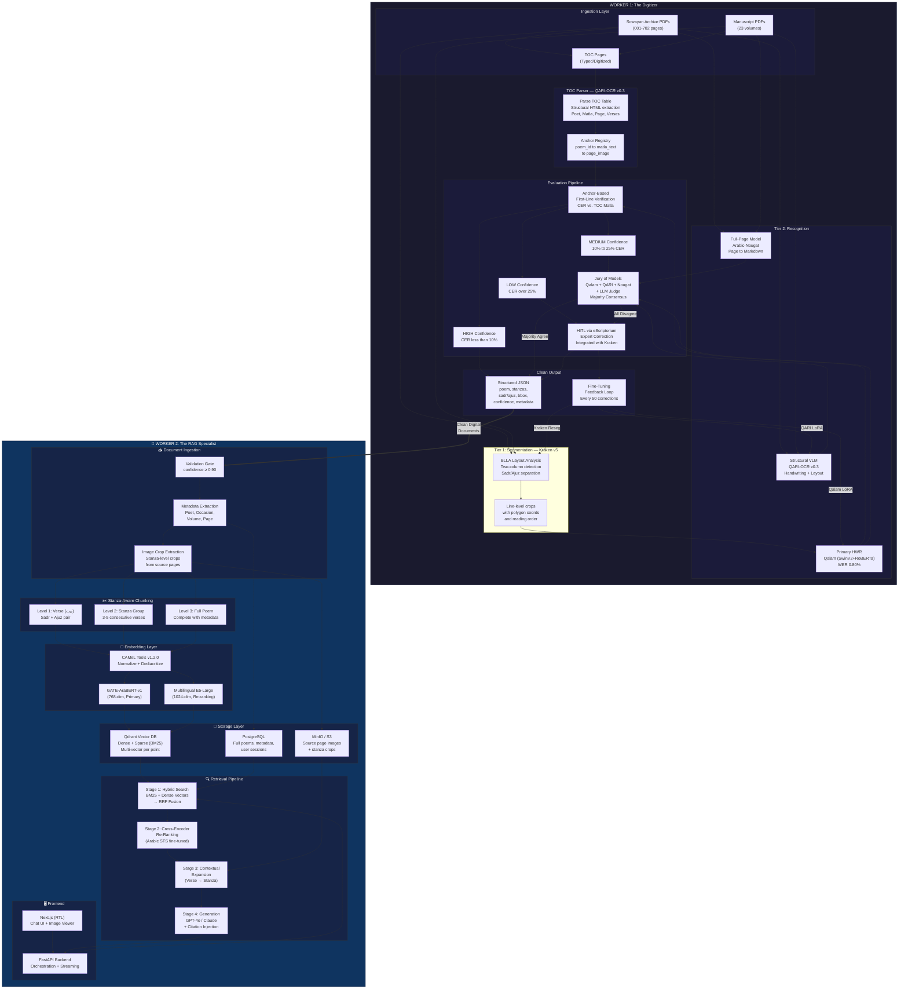

# Capstone Project: Technical Plan — Tasks A & B

## Digitizing & Querying Handwritten Khaleeji Nabati Poetry
### Two-Worker Pipeline Architecture

---

# TASK A: Literature Review, OCR Model Selection & Evaluation Workflow (Worker 1)

## A.1 — Literature Review: State of the Art in Arabic HTR

### The Core Challenge

Arabic Handwritten Text Recognition (HTR) remains significantly behind Latin-script HTR due to three intrinsic difficulties: (1) the cursive, connected nature of Arabic script where character shapes vary based on position, (2) the prevalence of diacritical marks (dots, tashkeel) that are easily lost in degraded manuscripts, and (3) the right-to-left directionality combined with variable ligatures. For Nabati poetry specifically, we add a fourth challenge: archaic vocabulary and dialectal spelling conventions that deviate from Modern Standard Arabic (MSA), making language-model priors less effective.

### Category 1: Dedicated Arabic HTR Foundation Models

These are purpose-built encoder-decoder models trained specifically for Arabic handwriting recognition:

| Model | Architecture | Training Data | Best Performance | Key Strengths |
|---|---|---|---|---|
| **Qalam** (UBC/Invertible AI, 2024) | SwinV2 encoder + RoBERTa decoder | 4.5M+ Arabic manuscript images + 60k synthetic pairs | **WER 0.80%** (HWR), **WER 1.18%** (OCR) | Best-in-class Arabic HWR; exceptional diacritics handling; high-resolution input support. Foundation model trained at scale. |
| **HATFormer** (2024) | ViT encoder + Transformer decoder | Muharaf + synthetic | **CER 8.6%** on Muharaf (historical) / **4.2%** on non-historical | 51% improvement over baselines; novel image preprocessor; synthetic data generation pipeline |
| **TrOCR-Large-Arabic** (David-Magdy) | TrOCR-Large fine-tuned | KHATT + IAM | ~12% CER on KHATT | Dual-language (Arabic+English); strong generalization |
| **Multilingual HTR** (Broadwell et al., 2025) | TrOCR pipeline + layout recognition | Ottoman/Arabic archives | Not published | Addresses low-resource Arabic-script languages; includes transliteration |

### Category 2: Vision-Language Models (VLMs) for Arabic OCR

General-purpose VLMs adapted for Arabic OCR via parameter-efficient fine-tuning. Offer page-level understanding and structural awareness:

| Model | Base | Approach | Performance | Key Strengths |
|---|---|---|---|---|
| **QARI-OCR v0.3** (NAMAA-Space, 2025) | Qwen2-VL-2B-Instruct | LoRA (rank=16), 4-bit quant, iterative synthetic fine-tuning | v0.2: WER 0.160, CER **0.061** (diacritized print); v0.3: adds handwriting + structural parsing | v0.3 specifically adds handwritten text + HTML structural/layout parsing. Efficient (11hr single-GPU training). Structure-First Design for headers/body/annotations. |
| **Qwen2.5-VL Arabic OCR** (sherif1313) | Qwen2.5-VL-3B | LoRA 4-bit, mixed-domain | 29% CER reduction on modern print; 17% on historical | Explicit handwriting support |
| **Baseer** (2025) | VLM fine-tuned for Arabic doc-to-markdown | Document-level | WER 0.25 | Document-level structural output |
| **Qwen3-VL** (2026) | Qwen3-VL (various sizes) | Native 32-language OCR | Robust in low-light, blur, tilt; rare/ancient character handling | Most promising general-purpose candidate; 32-language support |

### Category 3: Document-to-Structured-Output Models

These models output structured text (Markdown, HTML) preserving document layout — highly relevant for poetry with Sadr/Ajuz columns:

| Model | Architecture | Output Format | Training Data | Key Strengths |
|---|---|---|---|---|
| **Arabic-Nougat** (MohamedAliRashad, 2024) | Meta Nougat (ViT) fine-tuned | **Markdown** | arabic-img2md (13.7k pairs); 1.1B token Arabic corpus from 8.5k+ books | Full-page → structured Markdown; three sizes (small/base/large); Aranizer-PBE-86k tokenizer; preserves document structure (headers, paragraphs, tables) |
| **QARI-OCR v0.3** (also fits here) | Qwen2-VL-2B | **HTML with spatial layout** | Synthetic mixed-font + structural | HTML spatial/layout parsing; understands headers, body, annotations |

### Category 4: Segmentation & Training Infrastructure

These are not recognition models but provide the critical pipeline infrastructure for layout analysis and model training:

| Tool | Type | Key Features | Relevance |
|---|---|---|---|
| **Kraken v5** (ICDAR 2025) | Open-source OCR/HTR engine | BLLA segmentation for Arabic; custom model training via `ketos`; eScriptorium integration; KITAB project uses it for Arabic manuscripts | **Segmentation backbone**: Line detection in our two-column Sadr/Ajuz layout. **Training infrastructure**: Train custom HTR models on our Sowayan data using eScriptorium for annotation. |
| **eScriptorium** | Web-based annotation platform | Integrates with Kraken; polygon-level text line annotation; model training UI; collaborative annotation | **HITL interface**: Provides production-ready annotation UI for expert correction of OCR output |

### Key Datasets

- **Muharaf** (NeurIPS 2024): 1,600+ historical Arabic manuscript pages, 36,000+ text line images spanning 19th–21st century. Diverse styles including poetry, letters, legal documents. The primary benchmark for Arabic HTR.
- **arabic-img2md** (Arabic-Nougat): 13.7k page-Markdown pairs from Arabic books; 1.1B extracted tokens from 8.5k books.
- **KHATT**: Large-scale Arabic handwriting dataset; used for TrOCR fine-tuning.
- **Qalam training data**: 4.5M+ Arabic manuscript images (largest Arabic HWR training set).
- **Sowayan Archive TOC** (our data): Provides structured metadata (Poet, Matla, Page, Verse Count) that can serve as a "Synthetic Label Factory" for alignment.

---

## A.2 — Recommended Model Strategy

### Primary Recommendation: Three-Tier Pipeline

Given the unique characteristics of our corpus (historical Khaleeji handwriting, two-column Sadr/Ajuz layout, archaic vocabulary), we recommend a **three-tier approach** that leverages each model category for its strengths:

### Tier 1: Layout Segmentation & Line Detection

**Tool: Kraken v5 + eScriptorium**

*Role:* Before any recognition model touches the text, we need to reliably detect and segment the two-column Sadr/Ajuz layout into individual text lines.

*Rationale:*
- Kraken's BLLA (Baseline Layout Analysis) segmentation is the industry standard for historical manuscripts
- The KITAB project has already validated Kraken on Arabic manuscript collections at scale
- eScriptorium provides a production-ready web UI for annotating and correcting segmentation — this becomes our HITL interface
- Fine-tuning Kraken's segmentation model requires only 30–50 annotated pages for book-specific layouts
- Critical for our data: the Sowayan archive has a consistent two-column layout within each volume but varies between volumes. Kraken can learn volume-specific layouts efficiently.

*Deliverable:* Per-page JSON with polygon coordinates for each detected text line, tagged as `sadr` (right column) or `ajuz` (left column), with reading order preserved.

### Tier 2: Primary Recognition — Handwritten Text Recognition

**Model: Qalam** (SwinV2 + RoBERTa) as primary, with **QARI-OCR v0.3** as structural fallback

*Rationale for Qalam as primary:*
- **WER 0.80% on HWR** — this is the best published result for Arabic handwriting recognition by a significant margin
- Trained on 4.5M+ Arabic manuscript images — the largest Arabic HWR training set, giving it the broadest exposure to handwriting variation
- Exceptional diacritics handling — critical since Nabati poetry uses selective tashkeel
- High-resolution input support — our scanned manuscripts are high-DPI archival scans
- Foundation model architecture (SwinV2 + RoBERTa) allows fine-tuning on our specific Khaleeji handwriting style

*Rationale for QARI-OCR v0.3 as structural complement:*
- v0.3 specifically adds **handwritten text support** + **HTML structural/layout parsing** — this is new and directly relevant
- Its Structure-First Design (trained on mixed headers/body/annotations) can parse the poem metadata (poet attributions like "مما قال المهادي" and "وله ايضاً") that Qalam might treat as regular text
- Efficient fine-tuning (11 hours, single GPU, 10k samples) via LoRA makes it feasible to create a domain-specific adapter
- **TOC Parsing**: QARI v0.3's structural understanding makes it ideal for parsing the Sowayan TOC tables (digitized typed text with tabular layout)

*Fine-tuning strategy:*
1. **Phase 1 — Zero-shot benchmarking**: Run both Qalam and QARI v0.3 on 50 sample pages. Measure CER/WER per-model and identify failure patterns (diacritics, ligatures, archaic words, layout confusion)
2. **Phase 2 — Sowayan TOC anchor alignment**: Use QARI v0.3 to parse the digitized TOC tables. Extract {Poet, Matla, Page, Verse Count}. Match each Matla to the corresponding handwritten page. Run Qalam on those pages and compare the first recognized line against the TOC Matla ground truth. This creates ~300+ verified training pairs without manual labeling.
3. **Phase 3 — Domain-specific fine-tuning**: Fine-tune Qalam on our aligned pairs using the Sowayan data. Fine-tune QARI v0.3's LoRA adapter on our specific handwriting style for structural metadata extraction.

### Tier 3: Full-Page Structured Output & Verification

**Model: Arabic-Nougat** (large variant) for Markdown-structured output

*Rationale:*
- Outputs **structured Markdown** from full pages — this directly maps to our RAG ingestion format
- Preserves document structure (headers, paragraphs, separators) — critical for detecting poem boundaries, poet attributions, and colophons
- Trained on 13.7k Arabic book page-Markdown pairs plus a 1.1B token corpus from 8.5k+ books
- The Aranizer-PBE-86k tokenizer is specifically optimized for Arabic text encoding
- Can serve as a third "vote" in the Jury of Models, providing an independent full-page interpretation

*Deployment:*
- Used as a **Markdown verification pass** after Qalam's line-level recognition
- Compares the Markdown structure (poem boundaries, verse counts) against the TOC metadata
- Flags structural disagreements (e.g., Qalam says 20 verses, Arabic-Nougat says 18, TOC says 20 → likely Nougat missed 2 lines)

### Tier Comparison Summary

| Tier | Model | Role | Granularity | Target Accuracy |
|---|---|---|---|---|
| 1 | **Kraken v5** | Layout segmentation | Page → Lines | ≥95% line detection |
| 2a | **Qalam** | Primary HWR | Line → Text | ≥92% CER (post fine-tune) |
| 2b | **QARI-OCR v0.3** | Structural parsing + TOC | Page → Structured HTML | ≥90% on typed TOC; ≥80% on handwritten |
| 3 | **Arabic-Nougat** | Full-page Markdown + verification | Page → Markdown | Structural verification |
| Jury | **HATFormer** | Historical HTR verification | Line → Text | Independent line-level check |

---

## A.3 — Evaluation Workflow: Anchor-Based Alignment + Jury of Models

### Overview

The evaluation pipeline is designed to bootstrap from zero labeled data using the Sowayan TOC as an anchor, then progressively build confidence through multi-model consensus.

### Step 1: TOC Parsing & Anchor Extraction

```
Input: Sowayan Archive PDF (e.g., manuscript05.pdf)
       └─ Last N pages contain digitized TOC table

TOC Structure (per row):
  ┌────────────┬───────────┬──────────────────────┬──────┬──────────────┐
  │ الشاعر     │ القصيدة   │ اول سطر من القصيدة   │ ص/ع  │ المناسبة     │
  │ Poet Name  │ Poem #    │ Matla (First Line)   │ Pg/V │ Occasion     │
  └────────────┴───────────┴──────────────────────┴──────┴──────────────┘
```

**Process:**
1. Programmatically extract the typed TOC pages (they are machine-readable since they're digitized/typed)
2. Parse each row to extract: `{poet_name, poem_id, matla_text, page_number, verse_count, occasion}`
3. Use `page_number` to map each Matla to the correct handwritten page image
4. The Matla serves as the ground-truth "anchor" for the first line of each poem

### Step 2: Anchor-Based First-Line Verification

For each poem identified via the TOC:

1. **Extract the handwritten page** at the specified page number
2. **Run the VLM (Qwen3-VL)** on the page to generate a full transcription
3. **Extract the first line** from the VLM output
4. **Compare against the TOC Matla** using:
   - Character Error Rate (CER)
   - Word Error Rate (WER)
   - Normalized Levenshtein Distance
5. **Classification:**
   - CER < 10%: **HIGH CONFIDENCE** → Accept VLM output, proceed to full poem
   - 10% ≤ CER < 25%: **MEDIUM CONFIDENCE** → Route to Jury of Models
   - CER ≥ 25%: **LOW CONFIDENCE** → Route to Human-in-the-Loop

### Step 3: Jury of Models (LLM-as-Judge)

For MEDIUM CONFIDENCE cases, deploy a panel of four independent judges:

| Judge | Model | Role |
|---|---|---|
| **Judge A** | **Qalam** (primary HWR) | Line-level transcription from segmented lines |
| **Judge B** | **QARI-OCR v0.3** (structural VLM) | Full-page structural transcription with HTML layout |
| **Judge C** | **Arabic-Nougat** (document model) | Full-page Markdown output with structural awareness |
| **Judge D** | GPT-4o / Claude (LLM-as-judge) | Linguistic coherence check — evaluates whether the transcription forms valid Arabic poetry (meter, rhyme, vocabulary) |
| *Tiebreaker* | **HATFormer** (historical HTR) | Called only when A/B/C disagree; provides independent line-level historical manuscript recognition |

**Consensus Protocol:**
- If 2/3 judges agree on a line → Accept majority transcription
- If all 3 disagree → Flag for HITL review
- Judge C specifically checks: (a) Arabic morphological validity, (b) poetic meter consistency (بحر), (c) rhyme scheme (قافية) alignment

### Step 4: Human-in-the-Loop (HITL) Interface — eScriptorium

For LOW CONFIDENCE cases and unresolved Jury disagreements:

**Platform: eScriptorium** (integrated with Kraken v5)

*Why eScriptorium over Label Studio or custom Gradio:*
- Purpose-built for manuscript transcription with polygon-level text line editing
- Native integration with Kraken for re-segmentation and re-recognition
- Collaborative annotation with multiple experts (critical for Nabati dialect knowledge)
- Built-in model training — corrections can directly trigger Kraken HTR model retraining
- Used in production by KITAB, OpenITI, and major Arabic manuscript digitization projects

**Interface panels (eScriptorium provides this natively):**
- Image panel: Original handwritten page with segmentation overlay (zoomable, pannable)
- Transcription panel: Pre-filled with Qalam/QARI output (editable per text line)
- Metadata panel: TOC anchor data (Poet, Matla, Occasion) for context
- Model comparison: Side-by-side view of all jury outputs for each disputed line

**Annotation workflow:**
1. Annotator sees highlighted disagreements between models (color-coded per judge)
2. Corrects the transcription using the original image as ground truth
3. Can re-segment lines if Kraken missed a line break or merged Sadr/Ajuz incorrectly
4. Corrections are logged and fed back into the fine-tuning dataset
5. After every 50 corrections, trigger:
   - Kraken segmentation model refresh (if layout errors were common)
   - Qalam LoRA adapter refresh (for recognition errors)
   - QARI-OCR v0.3 LoRA refresh (for structural parsing errors)

### Step 5: Full Poem Verification (Beyond the Matla Anchor)

The Matla anchor only verifies line 1 of each poem. For the remaining verses, we deploy a layered verification strategy:

#### Layer A: Multi-Variant Transcription Gateway (المنطوق vs. المكتوب)

**Critical design principle:** These manuscripts have never been digitized before. No external digital library exists to provide ground truth. The system must therefore produce its own verification through **multi-variant transcription** — acknowledging that "correct" is not a single answer but a spectrum between standardized spelling and dialectal pronunciation.

**The Spoken vs. Written Gateway:**

For each hemistich (شطر), the system produces multiple readings:

1. **النسخة الإملائية (Orthographic/Standard variant):** Follows Modern Standard Arabic spelling rules. Used for academic research and searchability. Example: "قال" (as written in standard Arabic)
2. **النسخة اللهجوية (Dialectal/Phonetic variant):** Follows the poet's regional pronunciation. Preserves the oral heritage authentically. Example: "جال" (Najdi pronunciation of قاف as /g/) or "يال" (some Emirati dialects)
3. **النسخة الأصلية (Manuscript variant):** The OCR'd text exactly as it appears in the handwriting, before any normalization

**The Geographic Dialect Atlas (القاموس الجغرافي):**

When the system encounters a word with multiple possible readings, it uses the poet's geographic origin (available from the TOC's poet metadata) to weight the most likely dialectal reading:

| Poet Origin | القاف (Qaaf) | الجيم (Jiim) | الكاف (Kaaf) | Example |
|---|---|---|---|---|
| نجد (Najd) | /g/ → "جال" | /j/ → standard | /k/ or /ts/ | حمود العبيد, عبيد بن رشيد |
| ساحل الإمارات (UAE Coast) | /g/ → "جال" | /y/ → "يال" in some words | /ch/ → "تش" | سالم الشليحي |
| عمان (Oman) | /g/ or /q/ | /j/ → standard | /k/ | — |
| الجوف (Al-Jouf) | /g/ → "جال" | /j/ → standard | /k/ | مرخان راعي الجوف |

**Technical implementation:**

```json
{
  "verse_id": "sowayan_v1_p7_v3",
  "sadr": {
    "manuscript_reading": "جال اللي ما شاف الدنيا...",
    "standard_reading": "قال الذي ما شاف الدنيا...",
    "dialectal_reading": "گال اللي ما شاف الدنيا...",
    "dialect_region": "najd",
    "variant_confidence": {
      "manuscript": 0.88,
      "standard": 0.95,
      "dialectal": 0.92
    },
    "ambiguous_words": [
      {
        "position": 0,
        "manuscript_form": "جال",
        "variants": ["قال", "جال", "گال"],
        "selected_standard": "قال",
        "selected_dialectal": "جال",
        "rationale": "Poet is from Najd; qaaf→gaaf is standard in this region"
      }
    ]
  },
  "ajuz": { ... }
}
```

**How this aids verification:**
- If the OCR reads "جال" and the poet is from Najd → this is a plausible dialectal reading of "قال", NOT an OCR error
- Without the dialect atlas, a naive spell-checker would flag "جال" as wrong, when it's actually the authentic pronunciation
- The system presents ALL variants to the HITL reviewer, who selects the most appropriate reading for publication
- Downstream RAG indexes ALL variants, enabling search by standard spelling, dialectal spelling, or manuscript spelling

#### Layer B: Poetic Structural Constraints (Meter + Rhyme)

Arabic Nabati poetry follows strict prosodic rules. These serve as a powerful verification signal:

1. **Meter identification:** Using the verified Matla, identify the بحر (meter) via automatic prosody analysis (e.g., BASRAH system at 98.6% precision, or deep learning meter detection via AraPoemBERT)
2. **Meter consistency check:** Every subsequent verse must conform to the same meter. A verse that breaks meter is flagged as a probable OCR error.
3. **Rhyme verification (قافية):** In Nabati poetry, the Ajuz (second hemistich) of every verse ends with a consistent rhyme pattern. Programmatically extract the last 2-3 characters of each Ajuz and verify consistency across the entire poem.
4. **Verse that scans correctly AND rhymes correctly is ~95% likely to be accurate** — even without external ground truth.

#### Layer C: Cross-Model Consensus (4-Model Agreement)

When no external clean text is available, model agreement serves as a proxy for ground truth:

| Agreement Level | Confidence | Action |
|---|---|---|
| 4/4 models agree (Qalam + QARI + Nougat + HATFormer) | ~99% | Auto-accept |
| 3/4 agree | ~95% | Accept majority reading; log minority for audit |
| 2/2 split | ~70% | Route to Layer D (LLM plausibility) |
| All disagree | ~40% | Route to HITL (eScriptorium) |

#### Layer D: LLM Linguistic Plausibility Check

For verses where model consensus is split, an LLM (GPT-4o/Claude) evaluates:

1. **Morphological validity:** Are all words valid Arabic morphological forms?
2. **Dialectal consistency:** Do the dialectal markers (Khaleeji/Nabati features) match across the poem?
3. **Semantic coherence:** Does the verse make sense in the context of the surrounding stanzas?
4. **OCR hallucination detection:** Flag words that don't exist in Arabic (common OCR failure mode)

#### Layer E: Verse Count & Structural Integrity

The TOC provides the expected verse count for each poem:

1. Compare Kraken's detected line-pair count against the TOC verse count
2. If counts match → structural integrity confirmed
3. If mismatch → identify where lines were merged, split, or missed
4. Verify that poet attribution markers ("وله ايضاً", "مما قال") are correctly identified as metadata, not verse text

#### Verification Decision Matrix

Since no external digital library exists for these manuscripts (they are being digitized for the first time), the system relies on structural, linguistic, and consensus-based verification:

| Multi-Variant Agreement? | Meter/Rhyme Valid? | Model Consensus | Result |
|---|---|---|---|
| All 3 variants consistent | Yes (meter + rhyme) | 4/4 agree | Auto-accept (~99% confidence) |
| Variants differ but all valid | Yes (meter + rhyme) | 3/4+ agree | Accept; present variants to user (~95%) |
| Dialectal ambiguity detected | Yes (meter only) | 3/4+ agree | Accept with dialect annotation (~90%) |
| Variants conflict | Partial | 2/4 agree | Route to LLM plausibility → HITL if unresolved |
| — | Fails meter/rhyme | Any | Route to HITL (likely OCR error) |

### Step 6: Output — Multi-Variant Digital Document

Each finalized poem produces a structured JSON document with multiple transcription variants:

```json
{
  "poem_id": "sowayan_vol1_p7",
  "poet": {
    "name": "حمود العبيد",
    "region": "najd",
    "dialect_profile": {
      "qaaf": "gaaf",
      "jiim": "standard",
      "kaaf": "standard"
    }
  },
  "matla": {
    "standard": "لولا الله المعبود ثم الكبيشه // ما سندن دون الجزيره ركابي",
    "dialectal": "لولا الله المعبود ثم الكبيشه // ما سندن دون اليزيره ركابي",
    "manuscript": "لولا الله المعبود ثم الكبيشه // ما سندن دون الجزيره ركابي"
  },
  "source_volume": "001-200",
  "source_page": 7,
  "verse_count": 5,
  "occasion": null,
  "meter": "الهلالي",
  "rhyme_letter": "ي",
  "confidence_score": 0.94,
  "evaluation_path": "anchor_verified + meter_verified + 4model_consensus",
  "stanzas": [
    {
      "stanza_num": 1,
      "sadr": {
        "standard": "لولا الله المعبود ثم الكبيشه",
        "dialectal": "لولا الله المعبود ثم الكبيشه",
        "manuscript": "لولا الله المعبود ثم الكبيشه",
        "ambiguous_words": []
      },
      "ajuz": {
        "standard": "ما سندن دون الجزيره ركابي",
        "dialectal": "ما سندن دون اليزيره ركابي",
        "manuscript": "ما سندن دون الجزيره ركابي",
        "ambiguous_words": [
          {
            "position": 3,
            "manuscript_form": "الجزيره",
            "variants": ["الجزيره", "اليزيره"],
            "rationale": "jiim→yaa variation possible but poet is Najdi (standard jiim)"
          }
        ]
      },
      "meter_valid": true,
      "rhyme_valid": true,
      "model_consensus": "4/4",
      "source_crop_bbox": [120, 45, 890, 95]
    }
  ],
  "source_image_path": "sowayan_vol1/page_007.png",
  "digitization_timestamp": "2026-04-01T12:00:00Z",
  "model_versions": {
    "segmentation": "kraken-v5-blla-sowayan",
    "primary_hwr": "qalam-swinv2-roberta",
    "structural_vlm": "qari-ocr-v0.3-lora-nabati",
    "document_model": "arabic-nougat-large",
    "verification_htr": "hatformer-muharaf-v2"
  }
}
```

---

# TASK B: RAG Architecture Design (Worker 2)

## B.1 — Architecture Overview

The RAG system ingests the clean digital output from Worker 1 and serves it through an intelligent retrieval-and-generation pipeline. The design is tailored for Arabic poetry, which requires stanza-aware chunking, bilingual embedding, and source-to-image mapping.

## B.2 — Component Details

### 1. Document Ingestion

**Input:** Clean JSON documents from Worker 1 (as defined above)

**Process:**
1. **Validation Gate:** Check `confidence_score ≥ 0.90` before ingestion; lower-confidence docs are queued for re-review
2. **Metadata Extraction:** Parse poet name, occasion, volume, page, verse count into a structured metadata store
3. **Image Crop Extraction:** Using `source_crop_bbox`, extract individual stanza images from the source page for "Source-to-Image" display
4. **Full-Text Indexing:** Store the complete poem text in a relational store (PostgreSQL) for exact-match and metadata queries

### 2. Chunking Strategy — Stanza-Aware Chunking

Standard RAG chunking (fixed token windows, recursive splitting) would destroy the fundamental unit of Arabic poetry: the بيت (bayt/verse), composed of a صدر (Sadr/first hemistich) and عجز (Ajuz/second hemistich).

**Our strategy:**

| Chunk Level | Content | Use Case |
|---|---|---|
| **Level 1: Verse (بيت)** | Single Sadr + Ajuz pair | Fine-grained retrieval — finding specific verses |
| **Level 2: Stanza Group** | 3–5 consecutive verses | Context-preserving retrieval — understanding a narrative arc |
| **Level 3: Full Poem** | Complete poem with metadata | Holistic queries — "show me a poem by حمود العبيد about battle" |

**Hierarchical chunking with parent-child relationships:**
- Each verse chunk stores a `parent_poem_id` and `stanza_position`
- Retrieval can "expand upward" — if a single verse is retrieved, the system can optionally include surrounding verses for context
- Metadata (poet, occasion, confidence) is attached to every chunk level

### 3. Embedding Models

Based on recent Arabic RAG benchmarks (ACL 2025), we recommend:

| Model | Dimension | Strengths | Role |
|---|---|---|---|
| **GATE-AraBERT-v1** | 768 | Best Arabic STS (82.78% on MTEB STS17-ar); Matryoshka loss enables variable dimensionality | **Primary embedding model** for semantic search |
| **Multilingual E5-Large** | 1024 | Top-5 Recall 0.88, MRR 0.48 on Arabic lexical retrieval; strong cross-lingual capability | **Secondary / re-ranking model**; useful for bilingual queries (Arabic↔English) |
| **Arabic-Triplet-Matryoshka-V2** | 768 | Triplet-based training; strong clustering | Alternative if GATE-AraBERT underperforms on dialectal text |

**Pre-processing pipeline (via CAMeL Tools v1.2.0):**
1. Normalize Arabic text (alef normalization, taa marbuta normalization)
2. Optionally dediacritize for embedding (since Nabati poetry typically lacks full tashkeel)
3. Tokenize using AraBERT tokenizer

### 4. Vector Database

**Recommendation: Qdrant**

| Criteria | Qdrant | Alternatives Considered |
|---|---|---|
| **Multi-vector support** | Native payload + multi-vector | Pinecone (limited), Weaviate (supported) |
| **Metadata filtering** | Rich filtering on payloads | All support this |
| **Hybrid search** | Dense + sparse (BM25) built-in | Weaviate has similar |
| **Self-hosted** | Yes, Docker-based | Pinecone is managed-only |
| **Arabic tokenization** | Custom tokenizers supported | Standard across all |
| **Cost** | Free (self-hosted) | Pinecone pricing model |

*Why Qdrant over alternatives:*
- Native support for storing multiple vectors per point (we store both GATE-AraBERT and E5 embeddings)
- Built-in hybrid search (dense semantic + sparse BM25) without external plugins
- Payload storage allows us to attach `source_crop_bbox` and `source_image_path` directly to each vector point
- Self-hosted; critical for heritage data that may have institutional restrictions

### 5. Retrieval Strategy

**Multi-Stage Retrieval Pipeline:**

1. **Stage 1 — Multi-Variant Hybrid Search (BM25 + Dense):**
   - BM25 runs against ALL three variants (standard, dialectal, manuscript) — a user searching "قال" will also find poems where the manuscript reads "جال" (dialectal qaaf→gaaf)
   - Dense (GATE-AraBERT) handles semantic similarity ("poems about longing for the desert") — embeddings are computed on the standard variant for consistency
   - Reciprocal Rank Fusion (RRF) merges both result sets

2. **Stage 2 — Cross-Encoder Re-Ranking:**
   - Top-20 candidates from Stage 1 are re-ranked using a cross-encoder fine-tuned on Arabic STS
   - This corrects for the bi-encoder's limitations with dialectal vocabulary

3. **Stage 3 — Contextual Expansion:**
   - If a single verse is the top result, expand to include the parent stanza group
   - Attach the original handwritten image crop for visual verification

4. **Stage 4 — Generation:**
   - Retrieved context + user query → LLM (GPT-4o or Claude) for response generation
   - System prompt includes instructions for Arabic poetry analysis (meter, theme, historical context)
   - **Critical:** The LLM is instructed to CITE specific verses with their source metadata (poet, volume, page)

### 6. Frontend Serving

**Architecture: Next.js + FastAPI**

| Component | Technology | Purpose |
|---|---|---|
| **Frontend** | Next.js (React) with RTL support | Chat UI with Arabic text rendering, image display |
| **Backend API** | FastAPI (Python) | Orchestrates retrieval pipeline, handles streaming |
| **Vector Store** | Qdrant (Docker) | Stores embeddings + metadata |
| **Relational DB** | PostgreSQL | Stores full poems, metadata, user sessions |
| **Image Store** | MinIO / S3 | Stores source page images and stanza crops |
| **LLM Gateway** | LiteLLM or direct API | Routes to GPT-4o / Claude for generation |

**Key UI Features:**
- Dual-pane display: AI response (left) + source handwritten image (right)
- Click any cited verse → shows the original manuscript crop with bounding box overlay
- Poet profile cards with linked poems
- Arabic-first design: full RTL layout, Arabic typography (Noto Naskh Arabic), proper Sadr/Ajuz formatting
- Search modes: Conversational (RAG), Exact text search, Browse by poet/occasion

---

## B.3 — Mermaid Architecture Diagram



---

## B.4 — Rubric Alignment Summary

### Deliverable 1 (Proposal) — Key Sections to Address:

| Rubric Section | Weight | Our Coverage |
|---|---|---|
| WHY: Problem Statement (clarity, context, measurability) | 10 pts | Heritage preservation; CER/WER as measurable metrics; stakeholders (ADALC, Poetry Academy, Archives) |
| WHY: Value Creation (articulation, quantification, consequences) | 20 pts | First digitized Nabati corpus; cost of losing oral heritage; 782+ pages quantified |
| Tech Breakthrough: Comparison | 15 pts | HATFormer vs. QARI-OCR vs. Qwen-VL benchmarked with CER |
| Tech Breakthrough: Secret Sauce | 25 pts | Anchor-Based Alignment using TOC as Synthetic Label Factory; **Multi-Variant Transcription (المنطوق vs. المكتوب)** with Geographic Dialect Atlas; Poetic meter/rhyme as structural verification signal; 4-Model Jury; Stanza-Aware Chunking with multi-variant RAG indexing |
| Execution Maturity | 20 pts | Two-worker pipeline; milestones; KPIs (CER, retrieval recall) |
| HOW: Implementation | 10 pts | Full tech stack; timeline |

### Deliverable 2 (Architecture Doc) — Key Sections:

| Rubric Section | Weight | Our Coverage |
|---|---|---|
| Problem Recap & System Goals | 5% | Refined problem with TOC-anchor strategy |
| Agentic System Architecture | 30% | Two-worker pipeline; Worker 1 (Digitizer) + Worker 2 (RAG); orchestration via confidence routing |
| Agent Design Specification | 20% | TOC Parser Agent, VLM Agent, HTR Agent, Jury Agent, HITL Coordinator, RAG Retriever Agent, Generation Agent |
| Tools, Models, Data Sources | 15% | Qwen3-VL, HATFormer, GATE-AraBERT, E5, Qdrant, PostgreSQL, CAMeL Tools — all justified |
| Workflow & Agent Interaction | 10% | Anchor-Based Alignment flow; confidence routing; feedback loop |
| Initial Implementation | 10% | TOC parser + VLM zero-shot on sample pages |
| Evaluation Strategy | 5% | CER, WER, retrieval recall@5, MRR, user satisfaction |
| Risks & Mitigation | 5% | OCR degradation, dialectal drift, hallucination in RAG, data quality |

---

## Sources

### HTR & OCR Models
- [Qalam: A Multimodal LLM for Arabic OCR and HWR (ACL ArabicNLP 2024)](https://aclanthology.org/2024.arabicnlp-1.19/)
- [HATFormer: Historic Handwritten Arabic Text Recognition with Transformers](https://arxiv.org/abs/2410.02179)
- [QARI-OCR v0.3: High-Fidelity Arabic Text Recognition (NAMAA-Space, 2025)](https://huggingface.co/NAMAA-Space/Qari-OCR-v0.3-VL-2B-Instruct)
- [QARI-OCR Paper: Multimodal LLM Adaptation](https://arxiv.org/abs/2506.02295)
- [Arabic-Nougat: Fine-Tuning ViTs for Arabic OCR and Markdown Extraction](https://arxiv.org/abs/2411.17835)
- [Arabic-Nougat GitHub (MohamedAliRashad)](https://github.com/MohamedAliRashad/arabic-nougat)
- [MedoHamdani Arabic OCR Collection](https://huggingface.co/collections/MedoHamdani/arabic-ocr-66ae13a62fa0af740f2b60d4)
- [Qwen2.5-VL Arabic Handwritten OCR (sherif1313)](https://huggingface.co/sherif1313/Arabic-handwritten-OCR-4bit-Qwen2.5-VL-3B-v1)
- [Baseer: Arabic Document-to-Markdown OCR](https://arxiv.org/abs/2509.18174)
- [Qwen3-VL (QwenLM)](https://github.com/QwenLM/Qwen3-VL)

### Segmentation & Infrastructure
- [Kraken OCR Engine v5 (ICDAR 2025)](https://github.com/mittagessen/kraken)
- [Kraken v5 Paper (Springer/ICDAR 2025)](https://link.springer.com/chapter/10.1007/978-3-032-04624-6_26)
- [eScriptorium Training Guide](https://ub-mannheim.github.io/eScriptorium_Dokumentation/Training-with-eScriptorium-EN.html)
- [KITAB Project OCR Pipeline (uses Kraken)](https://kitab-project.org/corpus/ocr)
- [Train Your Own HTR Models with Kraken (Digital Orientalist)](https://digitalorientalist.com/2023/09/26/train-your-own-ocr-htr-models-with-kraken-part-1/)

### Datasets
- [Muharaf Dataset (NeurIPS 2024)](https://arxiv.org/abs/2406.09630)
- [Multilingual HTR for Arabic-Script Languages (Broadwell et al., 2025)](https://papers.ssrn.com/sol3/papers.cfm?abstract_id=5190984)

### Prosody & Verification
- [BASRAH: Automatic Arabic Poetry Meter Identification (98.6% precision)](https://www.cambridge.org/core/journals/natural-language-engineering/article/abs/basrah-an-automatic-system-to-identify-the-meter-of-arabic-poetry/A6626118518BA9A265C41B80C7E5DCBE)
- [Deep Learning for Arabic Poetry Meter Detection (Frontiers AI 2025)](https://www.frontiersin.org/journals/artificial-intelligence/articles/10.3389/frai.2025.1523336/full)
- [AraPoemBERT: Pretrained Language Model for Arabic Poetry Analysis](https://arxiv.org/abs/2403.12392)
- [Aruudy: Arabic Prosody Library (GitHub)](https://github.com/kariminf/aruudy)

### RAG & Embeddings
- [GATE-AraBERT-v1 Embedding Model](https://huggingface.co/Omartificial-Intelligence-Space/GATE-AraBert-v1)
- [GATE Paper: Matryoshka Representation Learning for Arabic](https://arxiv.org/abs/2505.24581)
- [Evaluating RAG Pipelines for Arabic Lexical Retrieval (ACL 2025)](https://aclanthology.org/2025.abjadnlp-1.16/)
- [Exploring RAG in Arabic](https://arxiv.org/abs/2408.07425)
- [Towards a Fully Arabic RAG Pipeline (HuggingFace Blog)](https://huggingface.co/blog/Omartificial-Intelligence-Space/building-arabic-rag-pipeline-step-by-step)
- [Semantic Embeddings for Arabic RAG](https://thesai.org/Publications/ViewPaper?Volume=14&Issue=11&Code=IJACSA&SerialNo=135)
